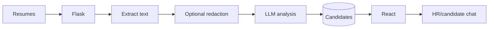

<div align="center">

# 🚀 AI Resume Screening Platform

**A React/Flask screening workspace with AI scoring, candidate chat, blind-review mode and bias indicators.**


[English](#english) · [فارسی](#فارسی) · [العربية](#العربية) · [Build Guide](./BUILD.md)

</div>

> [!IMPORTANT]
> **Verified repository status:** Feature-rich demo with a broken backend requirements file

## 🧭 Architecture




---

## English

### 📌 Overview

A React/Flask screening workspace with AI scoring, candidate chat, blind-review mode and bias indicators.

This README is based on the current public source, dependency manifests, container files and runnable entry points. Implemented functionality is separated from roadmap claims, and known limitations are recorded instead of being hidden behind generic setup instructions.

### ✨ Core capabilities

- PDF/DOCX ingestion
- AI scoring
- Candidate/HR chat
- Blind resumes and bias indicators

### 🧱 Technology stack

| Layer | Technology |
|---|---|
| Frontend | React 18.2, CRA 5, Tailwind, Radix |
| Backend | Flask 2.3, SQLite |
| Documents | PyPDF2, python-docx |
| AI | OpenAI/Gemini integrations |

### 🔄 Operating model

1. Prepare the runtime and external services documented in [BUILD.md](./BUILD.md).
2. Configure secrets in local environment files or a secret manager; never commit them.
3. Start infrastructure and backend services before the user interface in multi-service projects.
4. Validate health checks, migrations, model files and provider connectivity.
5. Run tests and domain-specific validation before producing a release artifact.

### 🔐 Security, quality and limitations

- Requirements file contains unresolved merge separator
- Bias indicators do not guarantee fair/legal hiring

### 🛠 Build and deployment

Use **[BUILD.md](./BUILD.md)** for verified prerequisites, development commands, production build steps, tests and troubleshooting.

### 📄 Attribution and license

Verify the repository LICENSE and all third-party notices before redistribution or commercial use.

---

## فارسی

### 📌 معرفی پروژه

فضای غربالگری React/Flask با امتیازدهی هوشمند، چت، بررسی کور و شاخص سوگیری.

این مستند بر اساس سورس عمومی فعلی، فایل‌های وابستگی، تنظیمات کانتینر و نقاط ورود قابل مشاهده تهیه شده است. قابلیت‌های پیاده‌سازی‌شده از موارد نقشه راه جدا شده‌اند و محدودیت‌های واقعی Build به‌صورت شفاف ثبت شده‌اند.

### ✨ قابلیت‌های اصلی

- دریافت PDF/DOCX
- امتیازدهی هوشمند
- چت نامزد/منابع انسانی
- رزومه کور و شاخص سوگیری

### 🧱 پشته فناوری

| Layer | Technology |
|---|---|
| Frontend | React 18.2, CRA 5, Tailwind, Radix |
| Backend | Flask 2.3, SQLite |
| Documents | PyPDF2, python-docx |
| AI | OpenAI/Gemini integrations |

### 🔄 روند اجرا

۱. پیش‌نیازها و سرویس‌های بیرونی مندرج در [BUILD.md](./BUILD.md) را آماده کنید.  
۲. کلیدها را فقط در فایل محیطی خارج از Git یا Secret Manager نگه دارید.  
۳. در پروژه چندسرویسی، ابتدا دیتابیس، صف و بک‌اند و سپس رابط کاربری را اجرا کنید.  
۴. Health Check، Migration، فایل مدل و اتصال Providerها را بررسی کنید.  
۵. پیش از انتشار، تست فنی و اعتبارسنجی تخصصی حوزه را انجام دهید.

### 🔐 امنیت و محدودیت

- نسخه Runtime و Dependencyها را با Lockfile تثبیت کنید.
- اطلاعات شخصی، فایل آپلودی، کلید API و داده واقعی نباید وارد مخزن عمومی شود.
- ادعاهای دقت، امنیت یا آمادگی Production باید در محیط هدف دوباره ارزیابی شوند.
- محدودیت‌های اختصاصی پروژه در بخش انگلیسی بالا و `BUILD.md` ثبت شده‌اند.

### 🛠 نصب و Build

راهنمای کامل و دستورات قابل کپی در **[BUILD.md](./BUILD.md)** قرار دارد.

### 📄 مجوز و مالکیت

فایل `LICENSE`، اعتبار توسعه‌دهندگان اصلی و مجوز کتابخانه‌های ثالث باید حفظ شود. در پروژه‌های upstream یا fork، مالکیت به سازمان بارمانا منتقل نمی‌شود.

---

## العربية

### 📌 نظرة عامة

منصة فرز React/Flask بتقييم ذكي ومحادثة ومراجعة عمياء ومؤشرات تحيز.

أُعد هذا التوثيق اعتماداً على المصدر العام الحالي وملفات التبعيات والحاويات ونقاط التشغيل المتاحة. وهو يميز بين الوظائف المنفذة وخارطة الطريق ويذكر قيود البناء الفعلية بوضوح.

### ✨ القدرات الأساسية

- استقبال PDF/DOCX
- تقييم ذكي
- محادثة المرشح/الموارد البشرية
- سيرة عمياء ومؤشرات تحيز

### 🧱 التقنيات

| Layer | Technology |
|---|---|
| Frontend | React 18.2, CRA 5, Tailwind, Radix |
| Backend | Flask 2.3, SQLite |
| Documents | PyPDF2, python-docx |
| AI | OpenAI/Gemini integrations |

### 🔄 مسار التشغيل

١. جهز المتطلبات والخدمات الخارجية الواردة في [BUILD.md](./BUILD.md).  
٢. احتفظ بالأسرار في ملف بيئة غير متتبع أو مدير أسرار.  
٣. شغّل قواعد البيانات والطوابير والخلفية قبل الواجهة في الأنظمة متعددة الخدمات.  
٤. تحقق من الصحة والترحيلات وملفات النماذج واتصال المزوّدين.  
٥. نفذ الاختبارات والتحقق المتخصص قبل إصدار نسخة للنشر.

### 🔐 الأمان والقيود

- ثبّت إصدارات التشغيل والتبعيات بملفات القفل.
- لا تضع بيانات شخصية أو ملفات مرفوعة أو مفاتيح API في مستودع عام.
- أعد التحقق من ادعاءات الدقة والأمان والجاهزية في بيئة الهدف.
- القيود الخاصة بالمشروع موثقة في القسم الإنجليزي و`BUILD.md`.

### 🛠 البناء والنشر

توجد التعليمات الكاملة والأوامر القابلة للنسخ في **[BUILD.md](./BUILD.md)**.

### 📄 النسب والترخيص

يجب الحفاظ على `LICENSE` وحقوق المطورين الأصليين وتراخيص المكونات الخارجية. وجود نسخة أو fork لا ينقل ملكية المصدر إلى Barmana-BRM.


---

<div align="center">

Made documentation-ready for the public portfolio of **Barmana-BRM**

</div>
=======
### 2. Backend Setup

```bash
# Navigate to backend directory
cd backend

# Create virtual environment
python -m venv venv

# Activate virtual environment
# Windows:
venv\Scripts\activate
# Linux/Mac:
# source venv/bin/activate

# Install dependencies
pip install -r requirements.txt

# Configure environment variables
cp .env.example .env
# Edit .env file and add your API keys
```

### 3. Frontend Setup

```bash
# Navigate to frontend directory (in a new terminal)
cd frontend

# Install dependencies
npm install

# Start development server
npm start
```

### 4. Start the Application

```bash
# Terminal 1: Start backend server
cd backend
python app.py
# Backend runs on http://localhost:5000

# Terminal 2: Start frontend (if not already running)
cd frontend
npm start
# Frontend runs on http://localhost:3000
```

## 🔧 Configuration

### Environment Variables

Create a `.env` file in the `backend` directory:

```env
# OpenAI Configuration (Primary)
OPENAI_API_KEY=your_openai_api_key_here

# Gemini Configuration (Alternative)
GEMINI_API_KEY=your_gemini_api_key_here
GEMINI_ENDPOINT=https://your-gemini-endpoint.com/v1/chat/completions

# Application Configuration
FLASK_ENV=development
FLASK_DEBUG=True
DATABASE_URL=sqlite:///resume_screener.db
```

### API Keys Setup

#### OpenAI Setup (Recommended)
1. Visit [OpenAI Platform](https://platform.openai.com)
2. Create account and navigate to API Keys
3. Generate a new API key
4. Add to `.env` file as `OPENAI_API_KEY`

#### Gemini Setup (Alternative)
1. Obtain Gemini API key from your provider
2. Add to `.env` file as `GEMINI_API_KEY`
3. Configure the endpoint URL

## 📖 Usage Guide

### 1. **Upload Resumes**
- Navigate to "Upload Resume" in the navigation
- Drag and drop a PDF or DOCX file (or click to browse)
- Optionally add a job description for better matching
- Click "Upload & Analyze Resume"
- Watch the beautiful upload progress animation

### 2. **Dashboard Overview**
- View key statistics and metrics
- See recent candidates with quick actions
- Access all major features from the dashboard
- Beautiful cards with hover animations

### 3. **Candidate Management**
- Browse all candidates with advanced filtering
- Sort by score, name, experience, or upload date
- Search by name or skills
- Filter by qualification category
- View detailed candidate profiles

### 4. **AI Analysis**
- Comprehensive candidate evaluation
- Skills extraction and matching
- Experience level assessment
- Strengths and weaknesses analysis
- Hiring recommendations

### 5. **Bias Detection**
- Automatic bias analysis for all candidates
- View bias scores by category (gender, age, location, education)
- Access blind resume versions
- Get bias mitigation recommendations
- Toggle fair screening mode

### 6. **HR Assistant**
- Interactive AI chatbot for HR queries
- Ask questions like:
  - "Who are the top 5 candidates for Data Scientist role?"
  - "Show me candidates with Python and React skills"
  - "What's the average experience level?"
  - "Compare candidates for a senior developer position"

### 7. **Candidate Chat**
- Individual AI conversations about specific candidates
- Ask detailed questions about qualifications
- Get insights about cultural fit
- Explore specific skills and experience

## 🔌 API Endpoints

### Resume Management
- `POST /api/upload` - Upload and analyze resume
- `GET /api/candidates` - Get all candidates with filtering
- `GET /api/candidates/<id>` - Get specific candidate details

### Bias Detection & Fair Screening
- `GET /api/bias-analysis/<candidate_id>` - Get bias analysis
- `GET /api/blind-resume/<candidate_id>` - Get blind resume version
- `POST /api/fair-screening/toggle` - Toggle fair screening mode

### AI Chat & Assistance
- `POST /api/chat` - Chat about specific candidate
- `POST /api/hr-chat` - General HR queries and insights

### System & Analytics
- `GET /api/health` - Health check endpoint
- `GET /api/statistics` - Application statistics and metrics

## 🎨 UI Components & Animations

### Animation Features
- **Page Transitions**: Smooth slide animations between routes
- **Loading States**: Beautiful spinners and skeleton screens
- **Hover Effects**: Interactive button and card hover animations
- **Progress Indicators**: Animated upload progress and bias score meters
- **Micro-interactions**: Button clicks, form interactions, and feedback

### Design System
- **Color Palette**: Primary blues, success greens, warning oranges, danger reds
- **Typography**: Inter font family with proper font weights
- **Spacing**: Consistent spacing scale using Tailwind utilities
- **Shadows**: Layered shadow system for depth and hierarchy
- **Border Radius**: Consistent rounded corners throughout the app

## 🧪 Development

### Project Structure
```
resume-screener-bot/
├── backend/
│   ├── app.py                 # Main Flask application
│   ├── requirements.txt       # Python dependencies
│   ├── .env                   # Environment variables
│   ├── services/
│   │   ├── __init__.py        # Services module
│   │   ├── resume_parser.py   # PDF/DOCX text extraction
│   │   ├── openai_service.py  # AI model integration
│   │   ├── bias_detection.py  # Bias analysis engine
│   │   └── database.py        # Database operations
│   └── uploads/               # Resume file storage
├── frontend/
│   ├── src/
│   │   ├── components/        # React components
│   │   │   ├── Layout/        # Navigation and layout
│   │   │   └── Upload/        # File upload components
│   │   ├── pages/             # Main application pages
│   │   │   ├── Dashboard.js   # Main dashboard
│   │   │   ├── Upload.js      # Resume upload page
│   │   │   ├── Candidates.js  # Candidate listing
│   │   │   ├── CandidateDetail.js # Individual candidate view
│   │   │   ├── HRAssistant.js # AI chat assistant
│   │   │   └── BiasAnalysis.js # Bias detection interface
│   │   ├── services/          # API and utilities
│   │   ├── config.js          # Application configuration
│   │   └── App.js             # Main React application
│   ├── public/                # Static assets
│   ├── package.json           # Node.js dependencies
│   ├── tailwind.config.js     # Tailwind CSS configuration
│   └── postcss.config.js      # PostCSS configuration
└── README.md                  # This file
```

### Adding New Features

#### Backend Features
1. Add new endpoints in `app.py`
2. Create service functions in `services/`
3. Update database models if needed
4. Add proper error handling and validation

#### Frontend Features
1. Create new components in `components/`
2. Add new pages in `pages/`
3. Update routing in `App.js`
4. Add API calls using the service layer

### Code Style Guidelines
- **Python**: Follow PEP 8 standards
- **JavaScript**: Use ES6+ features and functional components
- **CSS**: Use Tailwind utility classes with custom CSS for complex animations
- **Comments**: Document complex logic and API integrations

## 🐛 Troubleshooting

### Common Issues

#### Backend Issues
1. **OpenAI API Errors**
   - Verify API key in `.env` file
   - Check OpenAI service status
   - Ensure sufficient credits in OpenAI account
   - Check rate limits and usage quotas

2. **File Upload Issues**
   - Verify file size (max 16MB)
   - Check file format (PDF/DOCX only)
   - Ensure `uploads/` directory exists and is writable
   - Check disk space availability

3. **Database Issues**
   - Ensure SQLite is properly installed
   - Check database file permissions
   - Verify database initialization

#### Frontend Issues
1. **Connection Issues**
   - Verify backend server is running on port 5000
   - Check CORS settings in Flask app
   - Confirm API_BASE_URL in config.js

2. **Build Issues**
   - Clear node_modules and reinstall: `rm -rf node_modules && npm install`
   - Check Node.js version compatibility
   - Verify all dependencies are installed

3. **Styling Issues**
   - Ensure Tailwind CSS is properly configured
   - Check PostCSS configuration
   - Verify all CSS imports

### Performance Optimization
- **Backend**: Implement caching for AI responses
- **Frontend**: Use React.memo for expensive components
- **Database**: Add indexes for frequently queried fields
- **Files**: Implement file compression for large uploads

## 🤝 Contributing

We welcome contributions! Please follow these steps:

1. **Fork the repository**
2. **Create a feature branch**: `git checkout -b feature/amazing-feature`
3. **Make your changes** with proper testing
4. **Commit your changes**: `git commit -m 'Add amazing feature'`
5. **Push to the branch**: `git push origin feature/amazing-feature`
6. **Open a Pull Request** with detailed description

### Development Guidelines
- Write comprehensive tests for new features
- Follow existing code style and patterns
- Update documentation for API changes
- Add proper error handling and validation
- Test across different browsers and devices

## 📄 License

This project is licensed under the MIT License - see the [LICENSE](LICENSE) file for details.

## 🙏 Acknowledgments

- **OpenAI** for providing powerful language models
- **React Team** for the amazing frontend framework
- **Tailwind CSS** for the utility-first CSS framework
- **Framer Motion** for beautiful animations
- **Flask Team** for the lightweight web framework

## 📞 Support

For support and questions:
- 📧 Create an issue in the GitHub repository
- 📖 Check the troubleshooting section above
- 💬 Review the API documentation
- 🔍 Search existing issues for solutions

## 🚀 Future Enhancements

- [ ] **Multi-language Support**: Resume analysis in multiple languages
- [ ] **Advanced Analytics**: Detailed hiring metrics and trends
- [ ] **Bulk Processing**: Upload and analyze multiple resumes simultaneously
- [ ] **ATS Integration**: Connect with popular Applicant Tracking Systems
- [ ] **Custom Scoring**: Configurable scoring algorithms and criteria
- [ ] **Resume Comparison**: Side-by-side candidate comparisons
- [ ] **Export Features**: PDF reports and Excel exports
- [ ] **User Authentication**: Multi-user support with role-based access
- [ ] **Audit Logging**: Compliance tracking and decision history
- [ ] **Mobile App**: Native mobile applications for iOS and Android
- [ ] **Video Analysis**: AI-powered video interview analysis
- [ ] **Skills Assessment**: Integrated coding challenges and assessments


